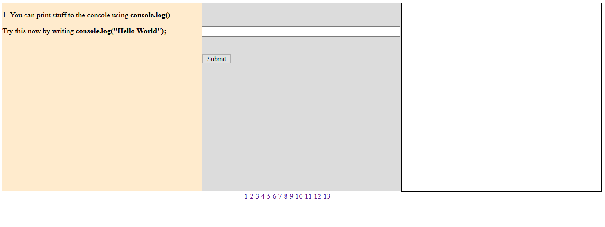

This project was made to help introduce students to Javascript, specifically about variables and if statements. It was done by having a series of questions that gave information to the user about the operation they were gonna do, then ask them to write it down on a form. The form then checks if the answer is correct and simulates printing the answer on a "terminal" for the user, allowing them to see a simulation of their code in action. 

This was a solo project done for [ICSpark](https://icspark.github.io/). A group dedicated to introducing middle and high school students to coding.

I leared a lot about maniuplating html elements with Javascript. I created the different questions by hiding and showing them depending on the page number the user clicked. I learned more about the different ways to access html elements instead of just their id. Furthermore, I also learned about how to update the text in html elements do display what I want to the user. I learned more about manipulating html forms such as making it so that submitting the form, either through the button or the enter key didn't reset the page, thus resetting the progress the user made.  

You can find the github repo at https://github.com/ICSpark/projects/tree/main/javascript-tutorial
