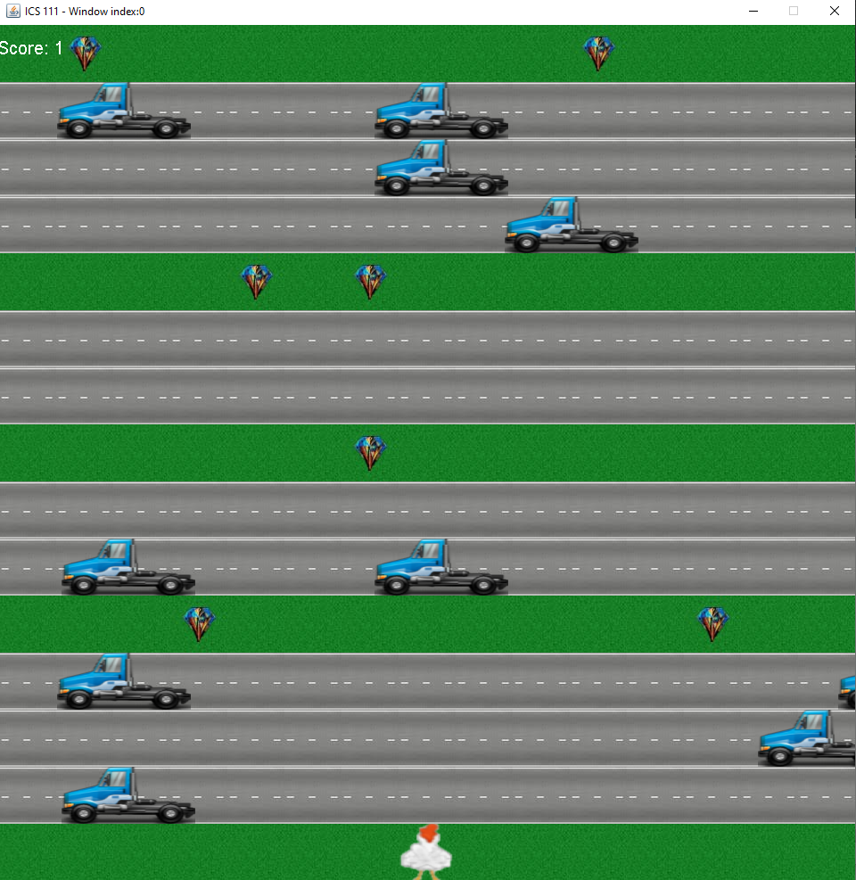

In this project, I worked with a partner to create our own version of a Frogger type game. The code generates a chicken that the player controls with the wasd keys. The goal of the game is to get the highest score by reaching the top part of the screen, if the truck hits the player, then it is game over. The code randomly selects one of 3 premade maps to generate grass, roads, and obstacles for the player. The chicken and trucks produce sound and a background sound was added to the game. As the player's score increases, the game becomes more difficult by having the trucks have a higher chance of moving faster.  

For this project, I worked on the chicken, its movement, sound, and collision with other objects, and on the map generation. I was also the one to decide on how to split the work between me and my partner. I also micro-managed our project by setting mini-goals for us to accomplish to make sure we were on track with our game. 

I learned about how to create an array and more implications you can do to generate a map from it. Furthermore, on project management with a partner, how to split the work between us and make sure we are completing our work appropriately. This was important because if one of us finished too early, then they will be stuck with nothing to do as they wait for the other person to finish so that they could continue working on their portion. Game over was never something I thought of too seriously, but working on this game has made me think of the various ways a game over can be achieved and implemented.
