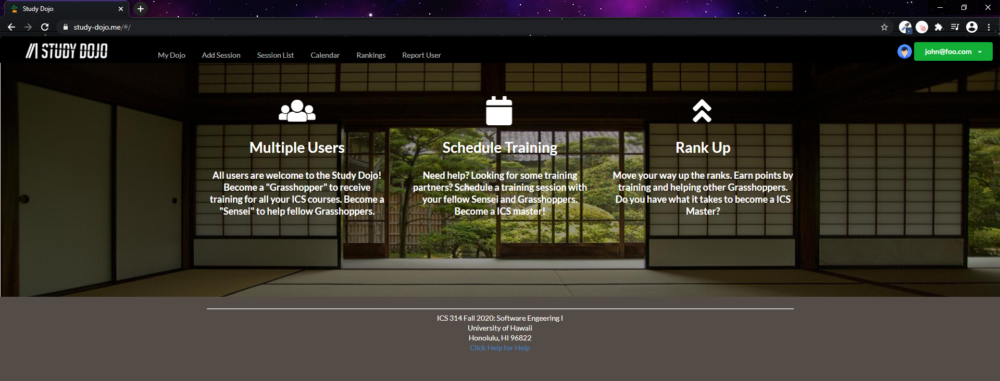

This project was worked on by me and three other students for our software engineering class. We designed an app using Meteor for students to organize study sessions amongst themselves. After signing up, they can go to the My Dojo page to register as a "grasshopper" or "sensei" for classes they attend. On the List Sessions page, the user can create a study session and specific the title of the study session, the class, and the date and time of the study session. This creates a notification to all other users registered for that class, allowing them to register for the study session. Participating in study sessions give users points, that are shown on the Leaderboard page. All study sessions are shown on the Calendar page.

For this project, I created the List Sessions page

[Click here to visit the project page.](https://study-dojo.github.io/)
